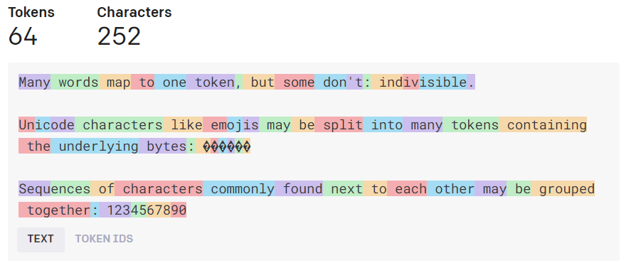

# Basic Information

## What is Faraday?

Faraday is a chat application that enables rich, meaningful interactions with personalized AI.

TODO ADD MORE HERE

## What is LLaMa?

LlaMa is a large language model (LLM) developed by Meta for use locally on consumer hardware. The LLaMa base model is a text completion model, meaning it will continue a given text, or ‘prompt’. The base LLaMa model comes in several sizes, each of which contain a different number of parameters, 7B, 13B, 33B and 65B. The number of parameters determines how specific the model’s text generation will match the input text. Higher parameter models give more nuanced and more accurate responses, but require significantly more memory and processing power to run. ChatGPT, for instance, is believed to be a significantly higher parameter model.

Meta recently released LLaMa 2, an evolution of their model. LLaMa was trained to work with a context of 2048 tokens, while LLaMa 2 was trained to work with a context of 4096 tokens, meaning it is able to base its response on a larger amount of input text. (A token is approximately 3 letters). Additionally, LLaMa 2 gives higher quality output, meaning a smaller LLaMa 2 model should perform better than a larger LlaMa 1 model. As such, a LLaMa 2 7B model should perform equivalently to a LLaMa 13B model, for instance.

Other groups have fine-tuned the LLaMa base models to prefer completing text in certain ways, such as instruction following (instruct) or chat. Additionally, individuals have gone further, combining multiple fine-tuned models together in different ways to create models that combine different qualities.

Faraday is primarily used with LLama based chat fine-tuned models. These models have been trained to continue a back-and-forth conversation between two or more parties. The model continues generating text until it begins generating the user’s response, at which point it stops and allows you to add the user’s side of the chat, before continuing with the ‘character’ response.

## Tokens and Context

Large Language Models (LLM)s generate the probability of the next portion of text based on the previous portion of text. To facilitate this, LLM’s work with tokens rather than letters or characters and base the probabilities on a certain number of previous tokens, or context.

### Tokens

A token is a chunk of characters, typically about three characters long (with exceptions). LLM’s do not see individual letters, but instead break text into these tokens. When you send a prompt to the model, the first thing that happens is that it is converted into tokens by the tokenizer. (This step works fastest using the GPU, which is why we try to offload parts of the models to the GPU). The model then returns predicted tokens which are converted back into text for us to read.

### Context

The text that is sent to the LLM is called the context. The context is composed of any instructions, character info, chat history, and the current response. LLMs are trained to look at a certain amount of tokens when generating their response, so our context is limited. LLaMa 1 based models are limited to 2048 tokens of context, while LLaMa 2 based models can use 4096 tokens of context. Because of this limit, the amount of information sent to the model (the prompt) is limited, most often resulting in part of the chat history being removed. The information in the character info is always kept, unless it alone extends beyond the context window.

Below is a visual of a text broken down into its tokens.

## Prompt Components

The model you chat with is a static file that does not change. Instead, what changes is what we send to it with each of our responses. This information is composed of four general components: instructions, character info, chat history, and our current response. The information is sent to the model in this order with your response being the last thing it sees.

### Instructions

Most models are trained to accept instructions that help it define what text it will generate. In Faraday, instructions are found in the character info, under advanced. The default instructions used in Faraday have proven to work very well, but changing them may help tailor the output to what you want. Unfortunately, the models will not always perfectly follow these instructions, so do not expect instructions to be followed verbatim.

### Character info

As we are primarily using chat fine-tuned models, Faraday formats responses to assume a back and forth dialogue. Character info is where we define who the chat is between, what they are like, and in what scenario they are interacting. Most character cards focus on describing the character that will be played by the model, but you can also define information about the user here, or even other characters.

### Chat history

Chat history is simply the back and forth chat you and the model have had up until this point.

### Response

Your response is the last thing appended to the prompt that is sent to the model.

## Rolling Context Window

All of the information sent to the model must fit within the model context, typically 4096 tokens (a token is approximately three characters of text). The model does not see information beyond this context window, so we need to specify how our information is cutoff to fit. Faraday will always include the instructions, the character info and our response. The rest of our context is filled with chat history (a reason to be concise with character info is to leave more room for chat history.). When this exceeds the context window, after you’ve been chatting for a while, the oldest history starts being removed from the information sent to the model. If you find the model forgetting something you talked about an hour ago, this is why.
